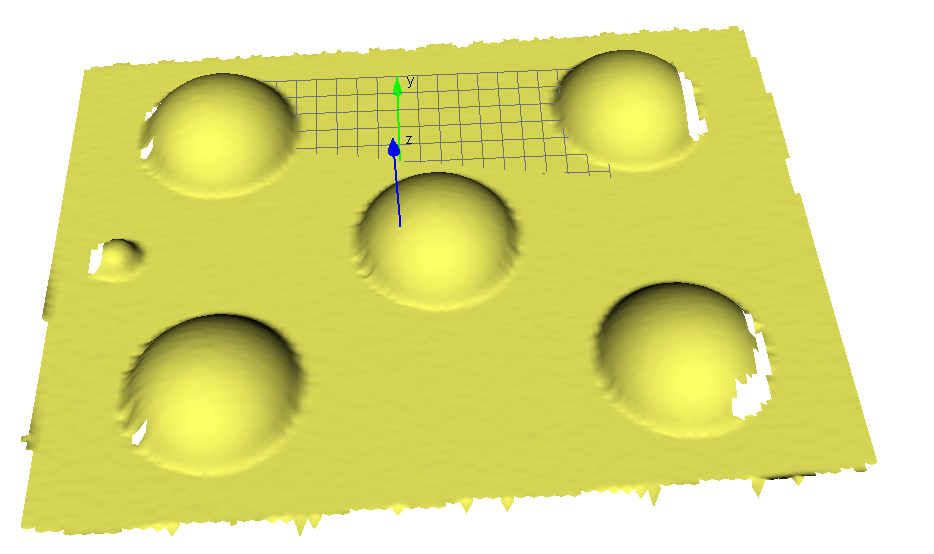
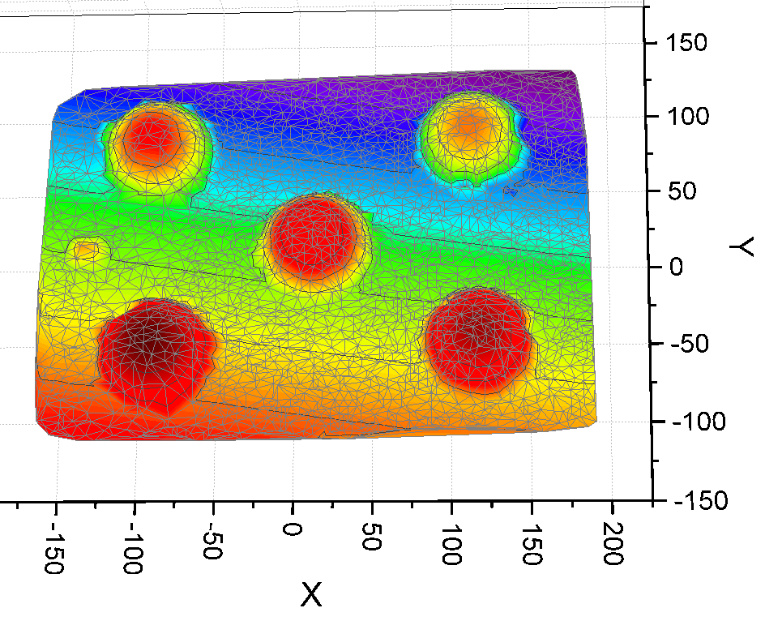

# SphereDetection

 Sphere detection algorithm: 

 

 Environment:  
 1. Programming language could be C/C++/OpenCL/CUDA. 
 2. Code compatible with Microsoft Visual C++ Compiler 2017. 
 3. Third-party libraries only Eigen (http://eigen.tuxfamily.org/), OpenMesh (http://www.openmesh.org/). 
 

 

 Task description:  
 Develop an application that receives a polygonal mesh with known topology, without single-disconnected points, maximal number of spheres, and fits the given number of spheres in the input mesh. 
 Additional parameters could be RMS distance threshold from the detected spheres. 
 The spheres can have different radius. 
 The application outputs the center and radius for each sphere. 
 

 

 Additional requirements:  
 - For a given example mesh algorithm should fit 5 spheres in less then 1 second (excluding I/O operations) on CPU Core i7 3Ghz) 
 - Production-grade code 
 - Cross-platform solution 
 

 
 

 C++ solution:  
 (-134.116, -0.66393, -5.40088): 22.7624 
 (15.8599, 3.00656, -8.71197): 39.0076 
 (-86.1648, 67.7641, -13.7157): 38.0571 
 (118.667, -62.3123, -1.53323): 38.342 
 (-79.3981, -71.0953, -3.86543): 45.195 
 (113.684, 76.0787, -21.11): 41.055  
 <a href="Cpp Implementation\points.txt" points.txt </a> used 

